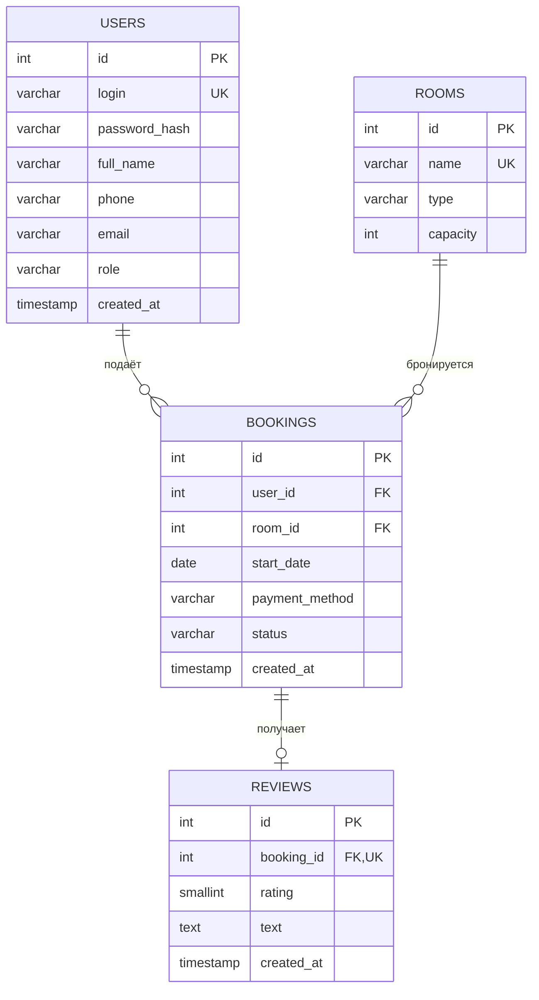

# ER-диаграмма

```mermaid
erDiagram
  USERS ||--o{ BOOKINGS : "подаёт"
  ROOMS ||--o{ BOOKINGS : "бронируется"
  BOOKINGS ||--o| REVIEWS : "получает"

  USERS {
    int id PK
    varchar login UK
    varchar password_hash
    varchar full_name
    varchar phone
    varchar email
    varchar role
    timestamp created_at
  }
  ROOMS {
    int id PK
    varchar name UK
    varchar type
    int capacity
  }
  BOOKINGS {
    int id PK
    int user_id FK
    int room_id FK
    date start_date
    varchar payment_method
    varchar status
    timestamp created_at
  }
  REVIEWS {
    int id PK
    int booking_id FK,UK
    smallint rating
    text text
    timestamp created_at
  }
```
